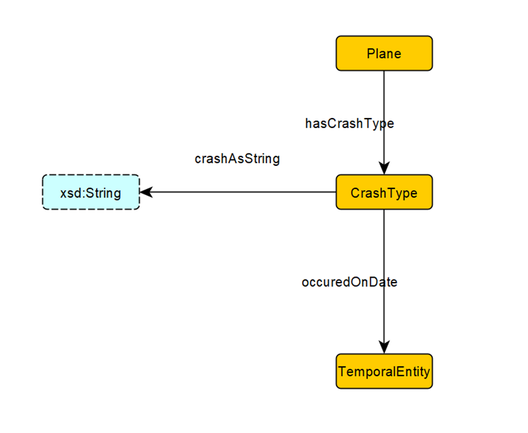

# Axioms based on Schemas :

[All Schemas Link](https://github.com/cs7810-group3/group3Project/tree/main/schema-diagrams)

## CrashType

 

### Axioms
* `CrashType SubClass Of Crash`  
Crash Types are part of the Crash Entity.
* `isCrashofType exactly 1 CrashType`  
There is only one Crash Type each time.
* `OccuredOnDate exactly 1 TemporalEntity`  
Each Crash Type occurs only once.

## CrashType

### Axioms
* `isCrashofType exactly 1 CrashType`  
Every crash has exactly one Crash Type.
* `OccuredOnDate exactly 1 TemporalEntity`  
Every Crash has occured exactly once.

## PlaneModel

### Axioms
* `PlaneModel SubClass Of Plane`  
Every Plane Model Belongs is part of the Plane Entity.
* `isPlaneModelType exactly 1 PlaneModel`  
A Plane Model is of only one Plane.

## PlaneID

### Axioms
* `PlaneID SubClass Of Plane`  
Every PlaneID is part of the Plane Entity.
* `hasPlaneID exactly 1 PlaneID`  
Every Plane has exactly one PlaneID.

## Part

### Axioms
* `isPartModelType min 1 PartModel`  
Each Part has at least one PartModel. 

## PartModel

### Axioms
* `EndDate max 1 TemporalEntity`  
Each PartModel has at most one EndDate.
* `hasIdentifier exactly 1 Identifier`  
Each PartModel has exactly one Identifier. 
* `StartDate exactly 1 TemporalEntity`  
Each PartModel has exactly one StartDate.

